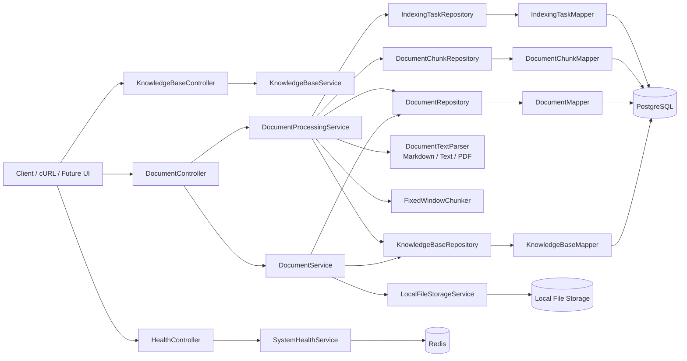

# RAG Service

一个面向企业内部知识库场景的 RAG 后端服务，用来沉淀结算领域文档，并逐步演进为可检索、可引用、可追溯的问答系统。

当前仓库已经完成了第 1 周核心工程骨架，并且已经落地了 Week 2 第一版问答闭环：

1. 知识库创建
2. 文档上传入库
3. 文档解析、切块与 chunk 入库
4. 文档 chunk 向量写库
5. query embedding 与 TopK 检索
6. Prompt 组装与 LLM 问答
7. `sources` 结构化来源返回
8. 问答记录持久化与历史查询

同时已经补齐了本地开发所需的基础设施底座：

1. PostgreSQL 容器化运行与持久化
2. Redis 容器化运行与持久化
3. Flyway 迁移恢复能力
4. 线程池基础配置
5. Redis 最小读写验证接口

当前状态已经不再停留在 Day 3 或 Day 4。

**第 1 周已经完成收口，Week 2 也已经完成第一版收口。**

这份 README 只描述当前仓库已经实现的内容，以及下一步明确要做的事情，不把规划写成现状。

## 项目目标

这个项目面向产品、开发、测试、运维等内部团队，解决以下问题：

1. 业务文档分散，检索成本高
2. 关键知识依赖资深同事经验，难沉淀
3. 排查问题时难以快速定位相关设计文档和操作手册
4. 新成员熟悉业务周期长

项目的目标不是做泛化聊天机器人，而是先把企业知识库 RAG 的主链路做完整：

```text
知识库创建 -> 文档上传 -> 原始文件存储 -> 元数据入库 -> 文档解析 -> 文本切块 -> 检索 -> 回答 -> 引用来源展示
```

## 当前已实现

当前仓库已经落地的能力：

1. Spring Boot 3 + Java 17 服务骨架
2. PostgreSQL 真连通
3. Redis 真连通
4. Flyway 迁移可执行
5. MyBatis-Plus 持久层已替换 JPA
6. `mapper + persistence + persistence/entity` 分层已收口
7. MyBatis-Plus 自动填充 `created_at / updated_at`
8. MyBatis-Plus 分页查询能力已接入
9. 统一响应结构 `ApiResponse`
10. 全局异常处理
11. 请求级 `X-Request-Id` 透传与生成
12. 健康检查接口 `/api/health`
13. Redis 探针接口 `/api/health/redis-probe`
14. 知识库创建、列表、详情、启用/禁用接口
15. 文档上传、列表、详情、chunk 查询、禁用、处理、重处理接口
16. 本地文件落盘
17. 文档去重校验
18. 知识库禁用后上传/处理保护
19. 文档状态枚举已预留到 `INDEXED / FAILED / DISABLED`
20. 文档 `media_type` 元数据已落库
21. Day 4 样本文档已补齐 `md / txt / pdf`
22. `document_chunk` 表、实体与 Repository 已落地
23. `md / txt` 第一版解析已落地
24. `pdf` 第一版基础解析已落地
25. 第一版固定长度切块已落地
26. 文档处理接口 `/process` 已接入
27. `indexing_task` 独立处理记录已落地
28. 基础线程池 `indexingExecutor`
29. Actuator 基础接入
30. `md / txt / pdf` 三类样本文档已完成 Day 6 真实联调验证
31. Markdown `media_type` 联调问题已发现并修正
32. `document_chunk` 已补齐 embedding 状态元数据
33. `qa/readiness` 观察接口已补入
34. 本地 embedding 与 `pgvector` 配置入口已明确
35. 本地 `bge-small-zh-v1.5` embedding 服务已接入并可返回真实向量
36. PostgreSQL 已切到 `pgvector`
37. `document_chunk.embedding_vector` 已在当前数据库中可用
38. 文档 chunk 向量写库第一版接口与服务已完成真实联调
39. 真实文档 `/embed` 已写入 `pgvector`
40. 本地 `bge-small-zh-v1.5` 模型加载与 512 维向量返回已验证

当前还没完成的能力：

1. 异步索引任务编排
2. 更完善的评测集与效果评测
3. session 复用与多轮对话
4. 混合检索与更高质量召回
5. 更完整的日志、观测与工程化补充

## 当前阶段

当前仓库可以分成两部分理解：

1. Week 1 已完成：知识库、文档上传、解析、切块、chunk 入库、联调验收都已经闭环。
2. Week 2 已完成：embedding、向量检索、问答、来源返回、问答记录与端到端验收都已经闭环。

现在项目的真实状态已经不是“RAG 设计中”，而是：

```text
知识库创建 -> 文档上传 -> 解析 -> 切块 -> chunk 入库 -> chunk 向量写库 -> query embedding -> TopK 检索 -> Prompt 组装 -> LLM 回答 -> 来源返回 -> 问答记录持久化 -> 历史查询
```

## 第 1 周完成情况

结合 [work/week1.md](/root/workspace/rag-system/work/week1.md) 的拆分目标，当前第 1 周已经覆盖并落实的内容包括：

1. Day 1：项目边界、目标和 README 大纲已明确
2. Day 2：核心表与状态模型已设计并落地到 Flyway
3. Day 3：Spring Boot、PostgreSQL、Redis、统一响应、异常处理、健康检查已完成
4. Day 4：文档上传、本地落盘、去重、元数据入库已完成
5. Day 5：`md / txt / pdf` 第一版解析、固定窗口切块、chunk 入库、`indexing_task` 记录已完成
6. Day 6：真实接口联调、字段校验、样本文档验证、问题修正已完成
7. Day 7：README、阶段文档和架构图收口

这意味着第 1 周的主线目标已经达成：

```text
项目骨架 -> 数据模型 -> 上传 -> 解析 -> 切块 -> chunk 入库 -> 联调验收 -> 文档沉淀
```

## 技术选型

- Java 17
- Spring Boot 3.5.14
- Spring Web
- Spring Validation
- MyBatis-Plus
- Spring Data Redis
- Spring Boot Actuator
- PostgreSQL
- Redis
- Flyway
- Lombok

当前配置里已经预留但尚未真正接入主链路的外围能力：

- `rag.embedding.*`
- `rag.llm.*`
- `rag.retrieval.*`
- 检索与生成模块第一版骨架

当前第 2 周采用的最小技术路线是：

- 本地 embedding 服务，模型为 `bge-small-zh-v1.5`
- 本地服务默认按 OpenAI-compatible `/v1/embeddings` 协议接入
- PostgreSQL 使用 `pgvector`
- 本地 embedding 服务代码位于 `embedding-service/`
- Java 侧通过 `POST /api/knowledge-bases/{kbCode}/documents/{documentCode}/embed` 触发向量写库
- 真实文档已经完成一次端到端 `/embed` 写库验证

## 架构图



## 当前架构

当前代码结构已经按“接口层 / 业务层 / 持久层 / 解析层”拆开：

- `controller`
  - 对外暴露 HTTP 接口，只负责参数接入和统一响应包装
- `service`
  - 编排业务流程、状态流转、异常语义
- `mapper`
  - MyBatis-Plus 原子数据库访问入口
- `persistence`
  - 面向业务的持久化访问封装
- `persistence/entity`
  - 数据库存储对象
- `persistence/query`
  - 分页与查询条件对象
- `model/request|response`
  - HTTP 请求/响应模型
- `ingestion/parser|chunk|storage`
  - 文档解析、切块、本地存储

## 目录结构

```text
rag-system/
├── docker-compose.yml
├── pom.xml
├── src/main/java/com/example/rag/
│   ├── RagApplication.java
│   ├── common/                # 统一返回、错误码、异常
│   ├── config/                # 配置属性、线程池、请求 ID 过滤器
│   ├── controller/            # HTTP 接口
│   │   ├── HealthController.java
│   │   ├── KnowledgeBaseController.java
│   │   ├── DocumentController.java
│   │   └── QuestionAnsweringController.java
│   ├── generation/            # 生成链路占位
│   ├── ingestion/
│   │   ├── chunk/             # 文本切块
│   │   ├── parser/            # 文档解析
│   │   └── storage/           # 本地文件存储
│   ├── integration/
│   │   └── llm/               # 本地 OpenAI-compatible 客户端骨架
│   ├── mapper/                # MyBatis-Plus Mapper
│   ├── model/
│   │   ├── dto/
│   │   ├── enums/
│   │   ├── request/
│   │   └── response/
│   ├── persistence/          # 持久化访问封装
│   │   └── entity/           # 数据库存储对象
│   │   └── query/            # 分页与查询条件
│   ├── retrieval/             # 检索链路占位
│   └── service/
├── src/main/resources/
│   ├── application.yml
│   ├── application-local.yml
│   └── db/migration/
│       ├── V1__init_schema.sql
│       ├── V2__drop_serial_defaults.sql
│       ├── V3__add_document_media_type.sql
│       ├── V4__create_document_chunk_table.sql
│       ├── V5__create_indexing_task_table.sql
│       ├── V6__add_chunk_embedding_metadata.sql
│       └── V7__enable_pgvector_and_add_chunk_vector.sql
├── data/                      # 本地持久化目录（已被 .gitignore 忽略）
└── work/                      # 过程文档与阶段记录
```

## 数据模型

当前 Flyway 脚本已落地四张表：

### `knowledge_base`

用于管理知识库本身。

核心字段：

- `kb_code`
- `name`
- `description`
- `status`
- `created_by`
- `created_at`
- `updated_at`

### `document`

用于保存原始文档元数据。

核心字段：

- `knowledge_base_id`
- `document_code`
- `file_name`
- `display_name`
- `file_type`
- `media_type`
- `storage_path`
- `file_size`
- `content_hash`
- `status`
- `version`
- `source`
- `tags`
- `error_message`

### `document_chunk`

用于保存解析和切块后的检索基础数据。

核心字段：

- `knowledge_base_id`
- `document_id`
- `chunk_index`
- `chunk_type`
- `title`
- `content`
- `content_length`
- `token_count`
- `start_offset`
- `end_offset`
- `metadata_json`
- `embedding_status`
- `embedding_model`
- `embedding_error_message`
- `embedding_updated_at`
- `embedding_vector`
- `status`

当前第 2 周第一版新增接口：

- `GET /api/knowledge-bases/{kbCode}/qa/readiness`
- `POST /api/knowledge-bases/{kbCode}/documents/{documentCode}/embed`
- `POST /api/knowledge-bases/{kbCode}/qa/retrieve`
- `POST /api/knowledge-bases/{kbCode}/qa/ask`
- `GET /api/knowledge-bases/{kbCode}/qa/history`

### `indexing_task`

用于独立记录一次文档处理任务的执行结果。

核心字段：

- `knowledge_base_id`
- `document_id`
- `task_type`
- `status`
- `parser_name`
- `chunk_count`
- `error_message`
- `started_at`
- `finished_at`

当前索引：

- `knowledge_base.kb_code` 唯一约束
- `document.document_code` 唯一约束
- `idx_document_kb_status`
- `idx_document_content_hash`
- `uk_document_chunk_document_index`
- `idx_document_chunk_kb_document`
- `idx_document_chunk_document_status`
- `idx_indexing_task_document_created`
- `idx_indexing_task_status`

当前文档状态枚举：

- `UPLOADED`
- `PARSING`
- `PARSED`
- `CHUNKING`
- `INDEXED`
- `FAILED`
- `DISABLED`

当前知识库状态枚举：

- `ACTIVE`
- `INACTIVE`

当前 chunk 状态枚举：

- `ACTIVE`
- `DISABLED`

## 联调记录

当前已经完成过一轮面向 `day6-kb` 的真实接口联调，覆盖 `md / txt / pdf` 三类样本：

1. Markdown 样本处理成功，`status = INDEXED`，`chunkCount = 2`
2. txt 样本处理成功，`status = INDEXED`，`chunkCount = 1`
3. PDF 样本处理成功，`status = INDEXED`，`chunkCount = 1`
4. `document_chunk` 与 `indexing_task` 都已在 PostgreSQL 中完成真实落库

这轮联调中还发现并修正了一个真实问题：

1. Markdown 经 `curl -F` 上传时，客户端可能上送通用 `application/octet-stream`
2. 服务现在会把这类通用二进制类型回退到扩展名判断
3. 因此 `.md` 文件现在能正确落成 `text/markdown`

## 本地运行

### 1. 启动基础设施

项目根目录已经提供 [docker-compose.yml](/root/workspace/rag-system/docker-compose.yml:1)：

```bash
docker compose up -d
```

当前会启动：

1. `rag-postgres`
2. `rag-redis`
3. `rag-embedding-service`

其中：

- PostgreSQL：`localhost:5432`
- Redis：`localhost:6379`
- Embedding Service：`localhost:8001`
- Redis 已启用密码：`rag_password`
- 模型目录挂载：`./data/models -> /models`
- 数据持久化目录：`./data/postgres`、`./data/redis`

本地 embedding 服务默认读取：

- 模型：`BAAI/bge-small-zh-v1.5`
- 路径：`/models/bge-small-zh-v1.5`
- 向量维度：`512`

### 2. 启动应用

```bash
mvn -s maven-settings.xml spring-boot:run
```

或者执行测试做一次完整启动校验：

```bash
mvn -s maven-settings.xml test
```

## 配置说明

主配置文件见 [src/main/resources/application.yml](/root/workspace/rag-system/src/main/resources/application.yml:1)。

当前关键配置包括：

```yaml
spring:
  datasource:
    url: jdbc:postgresql://localhost:5432/rag_db
    username: rag_user
    password: rag_password
  data:
    redis:
      host: localhost
      port: 6379
      password: rag_password
  flyway:
    enabled: true

rag:
  storage:
    base-dir: ./data/uploads
  embedding:
    provider: local-openai-compatible
    base-url: http://localhost:8001/v1
    model: bge-small-zh-v1.5
    vector-dimensions: 512
    embedding-path: /embeddings
    batch-size: 16
  retrieval:
    vector-store: pgvector
    default-top-k: 5
  llm:
    chat:
      base-url: http://localhost:8000/v1
      api-key: change-me
      model: deepseek-v4-pro
      chat-path: /chat/completions
      temperature: 0.2
      max-output-tokens: 1200
```

`application-local.yml` 负责本地环境增强配置，包括更细的日志级别。

如果切换到 DeepSeek，一份可用示例是：

```yaml
rag:
  llm:
    chat:
      base-url: https://api.deepseek.com
      api-key: ${DEEPSEEK_API_KEY}
      model: deepseek-v4-pro
      chat-path: /chat/completions
```

## 当前接口

### 1. 健康检查

```http
GET /api/health
```

当前返回除了服务状态，还会附带组件状态：

1. `postgres`
2. `redis`

### 2. Redis 连通探针

```http
POST /api/health/redis-probe
```

这个接口会执行一次最小 `set/get`，返回：

1. 写入 key
2. 写入值
3. 读出值
4. 是否一致

### 3. 创建知识库

```http
POST /api/knowledge-bases
Content-Type: application/json
```

请求示例：

```json
{
  "kbCode": "settlement-kb",
  "name": "Settlement Knowledge Base",
  "description": "Knowledge base for settlement documents",
  "createdBy": "codex"
}
```

### 4. 查询知识库列表

```http
GET /api/knowledge-bases?status=ACTIVE&pageNo=1&pageSize=20
```

支持参数：

- `status`，可选，当前支持 `ACTIVE / INACTIVE`
- `pageNo`，可选，默认 `1`
- `pageSize`，可选，默认 `20`，最大 `100`

### 5. 查询知识库详情

```http
GET /api/knowledge-bases/{kbCode}
```

### 6. 禁用知识库

```http
POST /api/knowledge-bases/{kbCode}/disable
```

### 7. 启用知识库

```http
POST /api/knowledge-bases/{kbCode}/enable
```

### 8. 上传文档

```http
POST /api/knowledge-bases/{kbCode}/documents/upload
Content-Type: multipart/form-data
```

表单字段：

- `file`
- `documentName`，可选
- `tags`，可选
- `source`，可选
- `operator`，可选

支持文件类型：

- `md`
- `txt`
- `pdf`

补充约束：

- 知识库状态为 `INACTIVE` 时不允许上传新文档
- 同一知识库下内容哈希重复的文档会被拦截

### 9. 查询文档列表

```http
GET /api/knowledge-bases/{kbCode}/documents?status=UPLOADED&pageNo=1&pageSize=20
```

支持参数：

- `status`，可选，当前支持 `UPLOADED / PARSING / PARSED / CHUNKING / INDEXED / FAILED / DISABLED`
- `pageNo`，可选，默认 `1`
- `pageSize`，可选，默认 `20`，最大 `100`

### 10. 查询文档详情

```http
GET /api/knowledge-bases/{kbCode}/documents/{documentCode}
```

### 11. 查询文档 chunk 列表

```http
GET /api/knowledge-bases/{kbCode}/documents/{documentCode}/chunks
```

这个接口会按 `chunk_index` 升序返回该文档全部 chunk，适合排查：

1. 解析结果是否完整
2. 切块边界是否合理
3. `metadata_json` 是否符合预期

### 12. 禁用文档

```http
POST /api/knowledge-bases/{kbCode}/documents/{documentCode}/disable
```

### 13. 处理文档

```http
POST /api/knowledge-bases/{kbCode}/documents/{documentCode}/process
```

这个接口负责：

1. 根据文件类型选择解析器
2. 执行第一版切块
3. 写入 `document_chunk`
4. 推进文档状态到 `INDEXED` 或 `FAILED`

补充约束：

- 知识库状态为 `INACTIVE` 时不允许处理文档
- 文档状态为 `DISABLED` 时不允许处理

### 14. 重处理文档

```http
POST /api/knowledge-bases/{kbCode}/documents/{documentCode}/reprocess
```

当前实现与 `/process` 复用同一条处理链路；重新处理时会先删除旧 chunk，再重新生成。

### 15. 执行文档向量化

```http
POST /api/knowledge-bases/{kbCode}/documents/{documentCode}/embed
```

这个接口负责：

1. 读取指定文档下可向量化的 chunk
2. 批量调用本地 embedding 服务
3. 将向量写入 `document_chunk.embedding_vector`
4. 更新 `embedding_status`

当前联调验证过的成功结果包括：

1. `embedding_status = EMBEDDED`
2. `embedding_model = bge-small-zh-v1.5`
3. `embedding_vector is not null`

### 16. 查询问答准备状态

```http
GET /api/knowledge-bases/{kbCode}/qa/readiness
```

这个接口用于观察当前知识库是否具备进入检索与问答阶段的前置条件，例如：

1. chunk 总数
2. 已完成 embedding 的 chunk 数
3. 当前 embedding 模型
4. 默认 `TopK`

### 17. 执行第一版基础检索

```http
POST /api/knowledge-bases/{kbCode}/qa/retrieve
Content-Type: application/json
```

请求示例：

```json
{
  "question": "结算异常应该怎么处理？",
  "topK": 3
}
```

这个接口负责：

1. 将问题文本转换成 query embedding
2. 在 `document_chunk.embedding_vector` 上执行 `pgvector` TopK 相似度检索
3. 返回命中的 chunk、文档定位信息和相似度分数

当前返回结果至少包含：

1. `knowledgeBaseCode`
2. `question`
3. `embeddingModel`
4. `topK`
5. `hitCount`
6. `chunks`

每条 `chunks` 结果当前至少包含：

1. `documentCode`
2. `documentName`
3. `chunkIndex`
4. `content`
5. `score`
6. `startOffset / endOffset`

## Day 10 联调样例

在 Day 9 已完成 `/embed` 的前提下，可以直接验证 `/qa/retrieve`。

### 1. 确认知识库已具备 embedding 数据

```bash
curl --noproxy '*' -s http://127.0.0.1:8080/api/knowledge-bases/day6-kb/qa/readiness
```

期望至少看到：

1. `questionAnsweringReady = true`
2. `embeddedChunkCount > 0`

### 2. 发起第一版检索请求

```bash
curl --noproxy '*' -s -X POST \
  http://127.0.0.1:8080/api/knowledge-bases/day6-kb/qa/retrieve \
  -H 'Content-Type: application/json' \
  -d '{
    "question": "这份文档主要讲了什么？",
    "topK": 3
  }'
```

如果你要沿用 Day 9 已验证过的真实文档上下文，也可以直接对 `day6-kb` 提类似问题，例如：

1. `这份 Markdown 文档讲了什么？`
2. `这个知识库里有哪些示例内容？`
3. `文档中提到了哪些关键主题？`

### 3. 检查返回结果

重点确认：

1. `hitCount` 大于 `0`
2. `chunks` 按相似度降序返回
3. 每条结果都带有 `documentCode / chunkIndex / content / score`
4. `embeddingModel` 与当前配置一致

### 18. 执行第一版问答

```http
POST /api/knowledge-bases/{kbCode}/qa/ask
Content-Type: application/json
```

请求示例：

```json
{
  "question": "这份文档主要讲了什么？",
  "topK": 3
}
```

这个接口负责：

1. 对问题生成 query embedding
2. 执行 TopK 相似度检索
3. 将检索结果拼成 prompt
4. 调用 OpenAI-compatible chat completion
5. 返回最终答案和基础召回结果

当前返回结果至少包含：

1. `question`
2. `answer`
3. `topK`
4. `chatModel`
5. `retrievalResults`
6. `sources`

约束说明：

1. 只基于检索内容回答
2. 不做多轮对话
3. 不做引用格式化

### 19. 查询问答历史

```http
GET /api/knowledge-bases/{kbCode}/qa/history?pageNo=1&pageSize=20
```

这个接口负责：

1. 分页查询指定知识库下的问答记录
2. 返回问题、答案、模型、来源和召回结果
3. 支撑 Day 13 之后的历史回放和效果复盘

当前返回结果至少包含：

1. `sessionCode`
2. `messageCode`
3. `question`
4. `answer`
5. `chatModel`
6. `topK`
7. `retrievalResults`
8. `sources`
9. `createdAt`

## Day 11 联调样例

如果要用 DeepSeek 做本地联调，可以通过运行时配置覆盖：

```bash
RAG_LLM_CHAT_BASE_URL=https://api.deepseek.com
RAG_LLM_CHAT_CHAT_PATH=/chat/completions
RAG_LLM_CHAT_API_KEY=${DEEPSEEK_API_KEY}
RAG_LLM_CHAT_MODEL=deepseek-v4-pro
```

然后调用：

```bash
curl --noproxy '*' -s -X POST \
  http://127.0.0.1:8080/api/knowledge-bases/day6-kb/qa/ask \
  -H 'Content-Type: application/json' \
  -d '{
    "question": "这份文档主要讲了什么？",
    "topK": 3
  }'
```

当前已经验证过一次真实结果：

1. `chatModel = deepseek-v4-pro`
2. 返回结果中包含 `retrievalResults`
3. 返回结果中包含 `sources`
4. `deepseek-v4-pro` 已基于检索内容返回可用回答

## Day 13 联调样例

先执行一次问答：

```bash
curl --noproxy '*' -s -X POST \
  http://127.0.0.1:8080/api/knowledge-bases/day6-kb/qa/ask \
  -H 'Content-Type: application/json' \
  -d '{
    "question": "这份文档主要讲了什么？",
    "topK": 3
  }'
```

再查询历史：

```bash
curl --noproxy '*' -s \
  'http://127.0.0.1:8080/api/knowledge-bases/day6-kb/qa/history?pageNo=1&pageSize=5'
```

当前已经验证过一次真实结果：

1. `/qa/ask` 成功后会写入 `chat_session / chat_message`
2. `/qa/history` 能查回刚写入的问题和答案
3. 历史结果里包含 `retrievalResults` 和 `sources`
4. 历史结果里包含 `latencyMs` 和 `promptTemplate`

## Day 14 联调样例

本次使用新的 `day14-kb` 做了完整验收：

```bash
curl --noproxy '*' -s -X POST \
  http://127.0.0.1:8080/api/knowledge-bases \
  -H 'Content-Type: application/json' \
  -d '{
    "kbCode": "day14-kb",
    "name": "Day 14 Acceptance KB",
    "description": "Week 2 end-to-end acceptance knowledge base",
    "createdBy": "codex"
  }'
```

```bash
curl --noproxy '*' -s -X POST \
  http://127.0.0.1:8080/api/knowledge-bases/day14-kb/documents/upload \
  -F 'file=@work/plan.md' \
  -F 'documentName=Week2 Acceptance Plan' \
  -F 'tags=day14,acceptance,week2' \
  -F 'source=work' \
  -F 'operator=codex'
```

```bash
curl --noproxy '*' -s -X POST \
  'http://127.0.0.1:8080/api/knowledge-bases/day14-kb/documents/DOC-309162419068997632/process?operator=codex'

curl --noproxy '*' -s -X POST \
  http://127.0.0.1:8080/api/knowledge-bases/day14-kb/documents/DOC-309162419068997632/embed

curl --noproxy '*' -s \
  http://127.0.0.1:8080/api/knowledge-bases/day14-kb/qa/readiness
```

```bash
curl --noproxy '*' -s -X POST \
  http://127.0.0.1:8080/api/knowledge-bases/day14-kb/qa/retrieve \
  -H 'Content-Type: application/json' \
  -d '{
    "question": "第2周的目标是什么？",
    "topK": 3
  }'

curl --noproxy '*' -s -X POST \
  http://127.0.0.1:8080/api/knowledge-bases/day14-kb/qa/ask \
  -H 'Content-Type: application/json' \
  -d '{
    "question": "第2周的目标是什么？",
    "topK": 3
  }'

curl --noproxy '*' -s \
  'http://127.0.0.1:8080/api/knowledge-bases/day14-kb/qa/history?pageNo=1&pageSize=5'
```

当前已经验证过一次真实结果：

1. `day14-kb` 已完成从上传到问答历史的完整闭环
2. `/qa/retrieve` 已返回 Week 2 目标相关 chunk
3. `/qa/ask` 已对问题“第2周的目标是什么？”返回“让项目从‘能跑’变成‘像样’”
4. `/qa/ask` 已对无关问题返回“根据当前检索内容，无法确定答案。”
5. `/qa/history` 已查回真实问答记录

## 已验证结果

当前仓库已经做过实际验证：

1. Spring Boot 可正常启动
2. PostgreSQL 可正常连接
3. Redis 可正常连接
4. Flyway 可成功执行迁移
5. 新建 PostgreSQL 容器后可重新建表
6. 知识库创建接口可写库
7. 文档上传接口可写库
8. 原始文件可保存到本地目录
9. 同知识库重复文件会被拦截
10. Redis 探针接口可完成一次最小读写
11. 文档处理集成测试可真实写入 `document_chunk`
12. MyBatis-Plus 自动填充 `created_at / updated_at` 已验证生效
13. MyBatis-Plus 分页查询已通过单测与启动验证
14. 本地 `bge-small-zh-v1.5` 模型已成功加载
15. 本地 embedding 服务已返回真实 512 维向量
16. `POST /embed` 已完成真实文档联调
17. `document_chunk.embedding_vector` 已验证非空
18. `mvn -q -DskipTests compile` 已通过
19. Day 10 `/qa/retrieve` 第一版接口已落地
20. Day 11 `/qa/ask` 第一版接口已落地
21. DeepSeek `deepseek-v4-pro` 已完成真实联调
22. Day 13 `/qa/history` 第一版接口已落地
23. 问答记录持久化与历史查询已完成真实联调
24. Day 14 端到端验收已完成

## 已实现的工程约束

### 统一返回结构

所有接口统一返回：

- `code`
- `message`
- `data`
- `requestId`
- `timestamp`

实现见 [ApiResponse.java](/root/workspace/rag-system/src/main/java/com/example/rag/common/ApiResponse.java:1)。

### 请求追踪

当前已经接入请求级 `X-Request-Id` 透传与生成，便于后续日志排障和接口追踪。

请求 ID 基于 Snowflake 算法生成；当系统时钟出现短暂回拨，或者同一毫秒内序列号耗尽时，生成器会阻塞等待到下一可用毫秒，而不是直接抛错。

### 基础线程池

当前已经提供 `indexingExecutor`，为后续异步解析、切块、索引任务预留执行器。

实现见 [ExecutorConfig.java](/root/workspace/rag-system/src/main/java/com/example/rag/config/ExecutorConfig.java:1)。

### 持久层约束

当前持久层已经明确切到 MyBatis-Plus，不再混用 JPA：

- `mapper` 只做数据库原子访问
- `persistence` 负责组合型查询和持久化语义封装
- `persistence/entity` 明确表示数据库持久化对象
- `config/MybatisPlusConfig.java` 同时维护分页插件和审计时间自动填充

当前不会再在 service 里手工维护 `createdAt / updatedAt`，统一交给 MyBatis-Plus 自动填充。

## 下一步

Week 1 已完成并完成收口，Week 2 也已经完成第一版收口。

如果后续继续推进，重点就不再是“把主链路做出来”，而是：

1. 建立评测集并做效果评测
2. 优化召回质量、答案质量和引用质量
3. 增加 session 复用与多轮对话
4. 继续补齐异步编排、日志和观测能力

更详细的阶段记录可参考：

1. [work/current-status.md](/root/workspace/rag-system/work/current-status.md)
2. [work/plan.md](/root/workspace/rag-system/work/plan.md)
3. [work/week1.md](/root/workspace/rag-system/work/week1.md)
4. [work/week2.md](/root/workspace/rag-system/work/week2.md)
5. [work/work day12.md](/root/workspace/rag-system/work/work%20day12.md)
