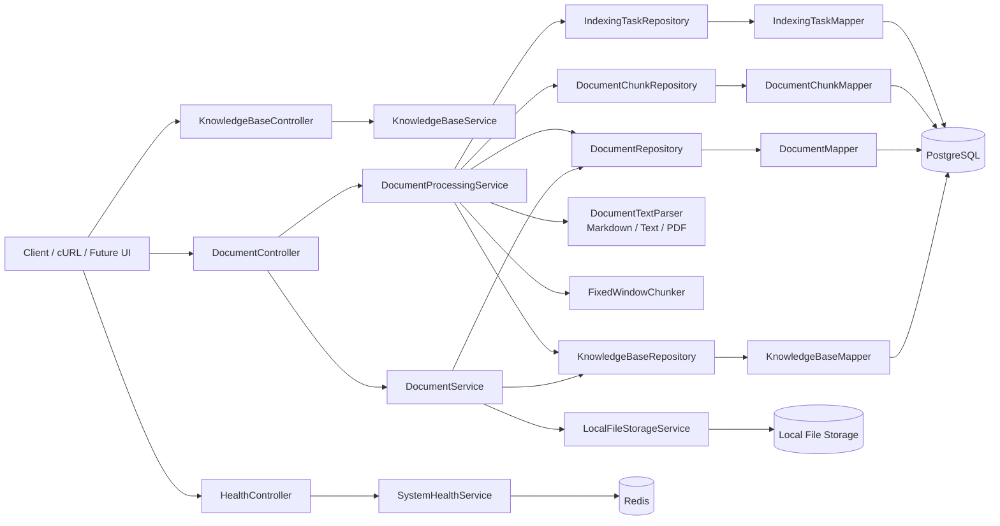

# RAG Service

一个面向企业内部知识库场景的 RAG 后端服务，用来沉淀结算领域文档，并逐步演进为可检索、可引用、可追溯的问答系统。

当前仓库已经完成了第 1 周核心工程骨架，并且已经落地了三段关键链路：

1. 知识库创建
2. 文档上传入库
3. 文档解析、切块与 chunk 入库

同时已经补齐了本地开发所需的基础设施底座：

1. PostgreSQL 容器化运行与持久化
2. Redis 容器化运行与持久化
3. Flyway 迁移恢复能力
4. 线程池基础配置
5. Redis 最小读写验证接口

当前状态已经不再停留在 Day 3 或 Day 4。

**第 1 周的目标已经完成收口，项目已经具备可运行、可联调、可讲清楚的文档入库主链路。**

这份 README 只描述当前仓库已经实现的内容，以及下一步明确要做的事情，不把规划写成现状。

## 项目目标

这个项目面向产品、开发、测试、运维等内部团队，解决以下问题：

1. 业务文档分散，检索成本高
2. 关键知识依赖资深同事经验，难沉淀
3. 排查问题时难以快速定位相关设计文档和操作手册
4. 新成员熟悉业务周期长

项目的目标不是做泛化聊天机器人，而是先把企业知识库 RAG 的主链路做完整：

```text
知识库创建 -> 文档上传 -> 原始文件存储 -> 元数据入库 -> 文档解析 -> 文本切块 -> 检索 -> 回答 -> 引用来源展示
```

## 当前已实现

当前仓库已经落地的能力：

1. Spring Boot 3 + Java 17 服务骨架
2. PostgreSQL 真连通
3. Redis 真连通
4. Flyway 迁移可执行
5. MyBatis-Plus 持久层已替换 JPA
6. `mapper + persistence + persistence/entity` 分层已收口
7. MyBatis-Plus 自动填充 `created_at / updated_at`
8. MyBatis-Plus 分页查询能力已接入
9. 统一响应结构 `ApiResponse`
10. 全局异常处理
11. 请求级 `X-Request-Id` 透传与生成
12. 健康检查接口 `/api/health`
13. Redis 探针接口 `/api/health/redis-probe`
14. 知识库创建、列表、详情、启用/禁用接口
15. 文档上传、列表、详情、chunk 查询、禁用、处理、重处理接口
16. 本地文件落盘
17. 文档去重校验
18. 知识库禁用后上传/处理保护
19. 文档状态枚举已预留到 `INDEXED / FAILED / DISABLED`
20. 文档 `media_type` 元数据已落库
21. Day 4 样本文档已补齐 `md / txt / pdf`
22. `document_chunk` 表、实体与 Repository 已落地
23. `md / txt` 第一版解析已落地
24. `pdf` 第一版基础解析已落地
25. 第一版固定长度切块已落地
26. 文档处理接口 `/process` 已接入
27. `indexing_task` 独立处理记录已落地
28. 基础线程池 `indexingExecutor`
29. Actuator 基础接入
30. `md / txt / pdf` 三类样本文档已完成 Day 6 真实联调验证
31. Markdown `media_type` 联调问题已发现并修正

当前还没完成的能力：

1. 异步索引任务编排
2. 向量化与检索
3. 大模型问答链路
4. 引用来源展示
5. 评测集与效果评测

## 第 1 周完成情况

结合 [work/week1.md](/root/workspace/rag-system/work/week1.md) 的拆分目标，当前第 1 周已经覆盖并落实的内容包括：

1. Day 1：项目边界、目标和 README 大纲已明确
2. Day 2：核心表与状态模型已设计并落地到 Flyway
3. Day 3：Spring Boot、PostgreSQL、Redis、统一响应、异常处理、健康检查已完成
4. Day 4：文档上传、本地落盘、去重、元数据入库已完成
5. Day 5：`md / txt / pdf` 第一版解析、固定窗口切块、chunk 入库、`indexing_task` 记录已完成
6. Day 6：真实接口联调、字段校验、样本文档验证、问题修正已完成
7. Day 7：README、阶段文档和架构图收口

这意味着第 1 周的主线目标已经达成：

```text
项目骨架 -> 数据模型 -> 上传 -> 解析 -> 切块 -> chunk 入库 -> 联调验收 -> 文档沉淀
```

## 技术选型

- Java 17
- Spring Boot 3.5.14
- Spring Web
- Spring Validation
- MyBatis-Plus
- Spring Data Redis
- Spring Boot Actuator
- PostgreSQL
- Redis
- Flyway
- Lombok

当前配置里已经预留但尚未真正接入主链路的外围能力：

- `rag.embedding.*`
- `rag.llm.*`
- 检索与生成模块占位

## 架构图



## 当前架构

当前代码结构已经按“接口层 / 业务层 / 持久层 / 解析层”拆开：

- `controller`
  - 对外暴露 HTTP 接口，只负责参数接入和统一响应包装
- `service`
  - 编排业务流程、状态流转、异常语义
- `mapper`
  - MyBatis-Plus 原子数据库访问入口
- `persistence`
  - 面向业务的持久化访问封装
- `persistence/entity`
  - 数据库存储对象
- `persistence/query`
  - 分页与查询条件对象
- `model/request|response`
  - HTTP 请求/响应模型
- `ingestion/parser|chunk|storage`
  - 文档解析、切块、本地存储

## 目录结构

```text
rag-system/
├── docker-compose.yml
├── pom.xml
├── src/main/java/com/example/rag/
│   ├── RagApplication.java
│   ├── common/                # 统一返回、错误码、异常
│   ├── config/                # 配置属性、线程池、请求 ID 过滤器
│   ├── controller/            # HTTP 接口
│   │   ├── HealthController.java
│   │   ├── KnowledgeBaseController.java
│   │   └── DocumentController.java
│   ├── generation/            # 生成链路占位
│   ├── ingestion/
│   │   ├── chunk/             # 文本切块
│   │   ├── parser/            # 文档解析
│   │   └── storage/           # 本地文件存储
│   ├── integration/
│   │   └── llm/               # OpenAI 兼容客户端占位
│   ├── mapper/                # MyBatis-Plus Mapper
│   ├── model/
│   │   ├── dto/
│   │   ├── enums/
│   │   ├── request/
│   │   └── response/
│   ├── persistence/          # 持久化访问封装
│   │   └── entity/           # 数据库存储对象
│   │   └── query/            # 分页与查询条件
│   ├── retrieval/             # 检索链路占位
│   └── service/
├── src/main/resources/
│   ├── application.yml
│   ├── application-local.yml
│   └── db/migration/
│       ├── V1__init_schema.sql
│       ├── V2__drop_serial_defaults.sql
│       ├── V3__add_document_media_type.sql
│       ├── V4__create_document_chunk_table.sql
│       └── V5__create_indexing_task_table.sql
├── data/                      # 本地持久化目录（已被 .gitignore 忽略）
└── work/                      # 过程文档与阶段记录
```

## 数据模型

当前 Flyway 脚本已落地四张表：

### `knowledge_base`

用于管理知识库本身。

核心字段：

- `kb_code`
- `name`
- `description`
- `status`
- `created_by`
- `created_at`
- `updated_at`

### `document`

用于保存原始文档元数据。

核心字段：

- `knowledge_base_id`
- `document_code`
- `file_name`
- `display_name`
- `file_type`
- `media_type`
- `storage_path`
- `file_size`
- `content_hash`
- `status`
- `version`
- `source`
- `tags`
- `error_message`

### `document_chunk`

用于保存解析和切块后的检索基础数据。

核心字段：

- `knowledge_base_id`
- `document_id`
- `chunk_index`
- `chunk_type`
- `title`
- `content`
- `content_length`
- `token_count`
- `start_offset`
- `end_offset`
- `metadata_json`
- `status`

### `indexing_task`

用于独立记录一次文档处理任务的执行结果。

核心字段：

- `knowledge_base_id`
- `document_id`
- `task_type`
- `status`
- `parser_name`
- `chunk_count`
- `error_message`
- `started_at`
- `finished_at`

当前索引：

- `knowledge_base.kb_code` 唯一约束
- `document.document_code` 唯一约束
- `idx_document_kb_status`
- `idx_document_content_hash`
- `uk_document_chunk_document_index`
- `idx_document_chunk_kb_document`
- `idx_document_chunk_document_status`
- `idx_indexing_task_document_created`
- `idx_indexing_task_status`

当前文档状态枚举：

- `UPLOADED`
- `PARSING`
- `PARSED`
- `CHUNKING`
- `INDEXED`
- `FAILED`
- `DISABLED`

当前知识库状态枚举：

- `ACTIVE`
- `INACTIVE`

当前 chunk 状态枚举：

- `ACTIVE`
- `DISABLED`

## 联调记录

当前已经完成过一轮面向 `day6-kb` 的真实接口联调，覆盖 `md / txt / pdf` 三类样本：

1. Markdown 样本处理成功，`status = INDEXED`，`chunkCount = 2`
2. txt 样本处理成功，`status = INDEXED`，`chunkCount = 1`
3. PDF 样本处理成功，`status = INDEXED`，`chunkCount = 1`
4. `document_chunk` 与 `indexing_task` 都已在 PostgreSQL 中完成真实落库

这轮联调中还发现并修正了一个真实问题：

1. Markdown 经 `curl -F` 上传时，客户端可能上送通用 `application/octet-stream`
2. 服务现在会把这类通用二进制类型回退到扩展名判断
3. 因此 `.md` 文件现在能正确落成 `text/markdown`

## 本地运行

### 1. 启动基础设施

项目根目录已经提供 [docker-compose.yml](/root/workspace/rag-system/docker-compose.yml:1)：

```bash
docker compose up -d
```

当前会启动：

1. `rag-postgres`
2. `rag-redis`

其中：

- PostgreSQL：`localhost:5432`
- Redis：`localhost:6379`
- Redis 已启用密码：`rag_password`
- 数据持久化目录：`./data/postgres`、`./data/redis`

### 2. 启动应用

```bash
mvn -s maven-settings.xml spring-boot:run
```

或者执行测试做一次完整启动校验：

```bash
mvn -s maven-settings.xml test
```

## 配置说明

主配置文件见 [src/main/resources/application.yml](/root/workspace/rag-system/src/main/resources/application.yml:1)。

当前关键配置包括：

```yaml
spring:
  datasource:
    url: jdbc:postgresql://localhost:5432/rag_db
    username: rag_user
    password: rag_password
  data:
    redis:
      host: localhost
      port: 6379
      password: rag_password
  flyway:
    enabled: true

rag:
  storage:
    base-dir: ./data/uploads
```

`application-local.yml` 负责本地环境增强配置，包括更细的日志级别。

## 当前接口

### 1. 健康检查

```http
GET /api/health
```

当前返回除了服务状态，还会附带组件状态：

1. `postgres`
2. `redis`

### 2. Redis 连通探针

```http
POST /api/health/redis-probe
```

这个接口会执行一次最小 `set/get`，返回：

1. 写入 key
2. 写入值
3. 读出值
4. 是否一致

### 3. 创建知识库

```http
POST /api/knowledge-bases
Content-Type: application/json
```

请求示例：

```json
{
  "kbCode": "settlement-kb",
  "name": "Settlement Knowledge Base",
  "description": "Knowledge base for settlement documents",
  "createdBy": "codex"
}
```

### 4. 查询知识库列表

```http
GET /api/knowledge-bases?status=ACTIVE&pageNo=1&pageSize=20
```

支持参数：

- `status`，可选，当前支持 `ACTIVE / INACTIVE`
- `pageNo`，可选，默认 `1`
- `pageSize`，可选，默认 `20`，最大 `100`

### 5. 查询知识库详情

```http
GET /api/knowledge-bases/{kbCode}
```

### 6. 禁用知识库

```http
POST /api/knowledge-bases/{kbCode}/disable
```

### 7. 启用知识库

```http
POST /api/knowledge-bases/{kbCode}/enable
```

### 8. 上传文档

```http
POST /api/knowledge-bases/{kbCode}/documents/upload
Content-Type: multipart/form-data
```

表单字段：

- `file`
- `documentName`，可选
- `tags`，可选
- `source`，可选
- `operator`，可选

支持文件类型：

- `md`
- `txt`
- `pdf`

补充约束：

- 知识库状态为 `INACTIVE` 时不允许上传新文档
- 同一知识库下内容哈希重复的文档会被拦截

### 9. 查询文档列表

```http
GET /api/knowledge-bases/{kbCode}/documents?status=UPLOADED&pageNo=1&pageSize=20
```

支持参数：

- `status`，可选，当前支持 `UPLOADED / PARSING / PARSED / CHUNKING / INDEXED / FAILED / DISABLED`
- `pageNo`，可选，默认 `1`
- `pageSize`，可选，默认 `20`，最大 `100`

### 10. 查询文档详情

```http
GET /api/knowledge-bases/{kbCode}/documents/{documentCode}
```

### 11. 查询文档 chunk 列表

```http
GET /api/knowledge-bases/{kbCode}/documents/{documentCode}/chunks
```

这个接口会按 `chunk_index` 升序返回该文档全部 chunk，适合排查：

1. 解析结果是否完整
2. 切块边界是否合理
3. `metadata_json` 是否符合预期

### 12. 禁用文档

```http
POST /api/knowledge-bases/{kbCode}/documents/{documentCode}/disable
```

### 13. 处理文档

```http
POST /api/knowledge-bases/{kbCode}/documents/{documentCode}/process
```

这个接口负责：

1. 根据文件类型选择解析器
2. 执行第一版切块
3. 写入 `document_chunk`
4. 推进文档状态到 `INDEXED` 或 `FAILED`

补充约束：

- 知识库状态为 `INACTIVE` 时不允许处理文档
- 文档状态为 `DISABLED` 时不允许处理

### 14. 重处理文档

```http
POST /api/knowledge-bases/{kbCode}/documents/{documentCode}/reprocess
```

当前实现与 `/process` 复用同一条处理链路；重新处理时会先删除旧 chunk，再重新生成。

## 已验证结果

当前仓库已经做过实际验证：

1. Spring Boot 可正常启动
2. PostgreSQL 可正常连接
3. Redis 可正常连接
4. Flyway 可成功执行迁移
5. 新建 PostgreSQL 容器后可重新建表
6. 知识库创建接口可写库
7. 文档上传接口可写库
8. 原始文件可保存到本地目录
9. 同知识库重复文件会被拦截
10. Redis 探针接口可完成一次最小读写
11. 文档处理集成测试可真实写入 `document_chunk`
12. MyBatis-Plus 自动填充 `created_at / updated_at` 已验证生效
13. MyBatis-Plus 分页查询已通过单测与启动验证

## 已实现的工程约束

### 统一返回结构

所有接口统一返回：

- `code`
- `message`
- `data`
- `requestId`
- `timestamp`

实现见 [ApiResponse.java](/root/workspace/rag-system/src/main/java/com/example/rag/common/ApiResponse.java:1)。

### 请求追踪

当前已经接入请求级 `X-Request-Id` 透传与生成，便于后续日志排障和接口追踪。

请求 ID 基于 Snowflake 算法生成；当系统时钟出现短暂回拨，或者同一毫秒内序列号耗尽时，生成器会阻塞等待到下一可用毫秒，而不是直接抛错。

### 基础线程池

当前已经提供 `indexingExecutor`，为后续异步解析、切块、索引任务预留执行器。

实现见 [ExecutorConfig.java](/root/workspace/rag-system/src/main/java/com/example/rag/config/ExecutorConfig.java:1)。

### 持久层约束

当前持久层已经明确切到 MyBatis-Plus，不再混用 JPA：

- `mapper` 只做数据库原子访问
- `persistence` 负责组合型查询和持久化语义封装
- `persistence/entity` 明确表示数据库持久化对象
- `config/MybatisPlusConfig.java` 同时维护分页插件和审计时间自动填充

当前不会再在 service 里手工维护 `createdAt / updatedAt`，统一交给 MyBatis-Plus 自动填充。

## 下一步

当前主链路已经推进到文档处理阶段，下一阶段应该继续补齐第 1 周尾项并进入检索主线：

1. 补 PDF 解析
2. 接入 embedding 与向量存储
3. 实现基础检索链路
4. 准备问答接口和引用来源展示
5. 开始评测与效果优化

更详细的阶段记录可参考：

1. [work/current-status.md](/root/workspace/rag-system/work/current-status.md)
2. [work/week1.md](/root/workspace/rag-system/work/week1.md)
3. [work/work day5.md](/root/workspace/rag-system/work/work%20day5.md)
