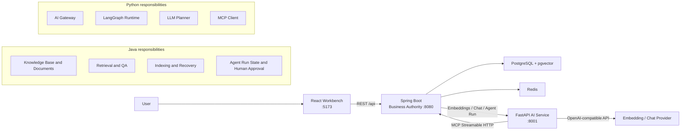

# RAG System

面向企业知识库场景的全栈 RAG 系统。项目覆盖文档接入、异步索引、Dense/Hybrid 检索、可溯源问答、运行状态治理，以及基于 LangGraph、LLM Planner 和 MCP 工具协议的运维诊断 Agent。

这不是只演示“向量检索 + LLM”的最小 Demo。当前仓库已经形成一套可运行的多服务架构：

- Java 负责知识库业务、RAG 编排、任务状态和 Agent 审计，是系统的业务权威。
- Python 负责模型能力网关和 LangGraph Agent Runtime，不直接写业务数据库。
- React 提供知识库、文档、检索、问答、健康检查和 Agent 人审工作台。
- PostgreSQL、pgvector 和 Redis 承载主数据、向量数据、任务状态与业务缓存。

## 核心能力

### 企业知识库与文档索引

- 知识库创建、启用、禁用、恢复和删除
- `md / txt / pdf` 文档上传、解析、固定窗口切块与内容去重
- 异步索引任务、阶段追踪、失败重试和卡死任务恢复
- 文档软禁用与恢复，保留历史 chunk 和向量
- embedding profile 变化后的全量重嵌入与 readiness gate

### 检索与问答

- PostgreSQL + pgvector 向量存储
- `DENSE / HYBRID` 双检索模式
- keyword recall + RRF fusion
- `LIKE / POSTGRES_FTS` 可配置 lexical strategy
- 结构化来源返回、问答历史和检索证据回放
- Redis 短 TTL 检索缓存及坏缓存自愈

### 智能运维 Agent

- LangGraph 固定诊断图与智能 Tool-use Agent
- 真实 LLM Planner，输出受校验的结构化 `AgentDecision`
- MCP Streamable HTTP：`initialize -> tools/list -> tools/call`
- Java 只读工具：系统健康、readiness、文档状态、索引任务、检索探测和检索配置检查
- Agent Run、Step、Action 持久化及完整执行轨迹
- 推荐动作确认/拒绝、风险级别、执行白名单和结果审计
- `embedding.rebuild.submit`、`document.indexing_task.retry` 人工确认闭环

### 工程化与可观测性

- Flyway 数据库迁移
- 统一 `ApiResponse`、异常处理和 `X-Request-Id`
- PostgreSQL、Redis、AI Gateway、embedding、LLM 健康探针
- 结构化日志与本地滚动日志
- 后端单元/集成测试、Python Runtime 测试和前端生产构建
- 中文问答评测集与 Dense/Hybrid 对比评测资产

## 系统架构


```mermaid
flowchart LR
    U[User] --> F[React Workbench<br/>:5173]
    F -->|REST /api| J[Spring Boot<br/>Business Authority :8080]

    J --> P[PostgreSQL + pgvector]
    J --> R[Redis]
    J -->|Embeddings / Chat / Agent Run| A[FastAPI AI Service<br/>:8001]

    A -->|OpenAI-compatible API| M[Embedding / Chat Provider]
    A -->|MCP Streamable HTTP| J

    subgraph Java responsibilities
        J1[Knowledge Base and Documents]
        J2[Retrieval and QA]
        J3[Indexing and Recovery]
        J4[Agent Run State and Human Approval]
    end

    subgraph Python responsibilities
        A1[AI Gateway]
        A2[LangGraph Runtime]
        A3[LLM Planner]
        A4[MCP Client]
    end
```

### 关键边界

1. **Java 是业务权威。** 知识库、文档、索引任务、Agent Run/Step/Action 状态和写操作都由 Java 管理。
2. **Python 是运行时。** Python 负责模型调用、LangGraph 编排和工具决策，不生成业务编码，也不直接操作业务表。
3. **LLM 不直接执行工具。** Planner 只返回结构化决策，Runtime 校验后才通过 MCP 调用可见工具。
4. **写操作必须受控。** MCP 注册表只暴露低风险只读工具；写操作由 Java 白名单、人审状态和风险规则统一执行。
5. **前端只调用 Java。** 浏览器不直接调用 Python Runtime 或内部 MCP 接口。

## 主要技术栈

| Layer | Technologies |
| --- | --- |
| Backend | Java 17, Spring Boot 3.5, MyBatis-Plus, Flyway |
| AI Service | Python 3.11+, FastAPI, LangGraph, HTTPX, Pydantic |
| Frontend | React 19, TypeScript, Vite, Ant Design, TanStack Query, Zustand |
| Data | PostgreSQL 16, pgvector, Redis 7 |
| AI Protocol | OpenAI-compatible embeddings/chat, MCP Streamable HTTP |
| Testing | JUnit, Spring Boot Test, Mockito, pytest, TypeScript build |

## 项目结构

```text
rag-system/
├── rag-backend/             # Java 业务主系统、RAG 编排、状态与审计中心
├── rag-ai-service/          # AI Gateway、LangGraph Runtime、LLM Planner、MCP Client
├── rag-frontend/            # 企业后台式 RAG 与 Agent 工作台
├── docs/
│   ├── rfcs/                # 长期架构决策
│   └── work/                # 各板块当前状态、计划和历史记录
├── docker-compose.yml       # PostgreSQL、Redis、RedisInsight、AI Service
├── pom.xml                  # Maven 工作区聚合入口
└── rag-system.code-workspace
```

## 快速开始

### 1. 环境要求

- JDK 17
- Maven 3.9+
- Python 3.11+
- Node.js 20+
- Docker 和 Docker Compose
- 可用的 OpenAI-compatible embedding/chat provider 凭证

默认端口：

| Service | Port |
| --- | ---: |
| PostgreSQL | `5432` |
| Redis | `6379` |
| RedisInsight | `5540` |
| rag-ai-service | `8001` |
| rag-backend | `8080` |
| rag-frontend | `5173` |

### 2. 启动 PostgreSQL 和 Redis

```bash
docker compose up -d postgres redis
docker compose ps
```

Flyway 会在 Java 后端启动时自动执行数据库迁移。

### 3. 配置并启动 AI Service

创建虚拟环境并安装依赖：

```bash
python3 -m venv .venv
./.venv/bin/pip install -e "./rag-ai-service[dev]"
```

配置模型凭证。以下只展示变量名，请勿把真实密钥提交到仓库：

```bash
export DASHSCOPE_API_KEY="<your-embedding-api-key>"
export DEEPSEEK_API_KEY="<your-chat-api-key>"
```

也可以通过以下能力级变量覆盖 provider、endpoint 和模型：

```bash
export EMBEDDING_PROVIDER="aliyun-bailian-openai-compatible"
export EMBEDDING_BASE_URL="https://dashscope.aliyuncs.com/compatible-mode/v1"
export EMBEDDING_API_KEY="<your-embedding-api-key>"
export EMBEDDING_DEFAULT_MODEL="text-embedding-v4"

export CHAT_PROVIDER="deepseek-openai-compatible"
export CHAT_BASE_URL="https://api.deepseek.com"
export CHAT_API_KEY="<your-chat-api-key>"
export CHAT_DEFAULT_MODEL="<your-chat-model>"
```

启动服务：

```bash
./.venv/bin/python -m uvicorn app.main:app \
  --app-dir rag-ai-service \
  --host 127.0.0.1 \
  --port 8001
```

Agent Runtime 默认使用：

- `AGENT_TOOL_CLIENT=mcp`
- Java MCP endpoint：`http://127.0.0.1:8080/api/internal/mcp`
- MCP 协议版本：`2025-06-18`
- Planner 模型：`AGENT_PLANNER_MODEL`，未设置时跟随 chat 默认模型

生产或共享环境必须替换 Java/Python 两端默认的内部工具 token，并保持两端值一致：

```bash
export RAG_AGENT_TOOL_TOKEN="<strong-internal-token>"
export MCP_TOOL_TOKEN="<strong-internal-token>"
```

### 4. 启动 Java 后端

```bash
mvn -pl rag-backend spring-boot:run
```

默认配置位于 [`rag-backend/src/main/resources/application.yml`](rag-backend/src/main/resources/application.yml)。本地日志写入：

```text
rag-backend/logs/rag-service.log
```

### 5. 启动前端

```bash
cd rag-frontend
npm ci
npm run dev
```

访问 <http://127.0.0.1:5173>。Vite 会把 `/api` 代理到 Java 后端的 `8080` 端口。

### 6. 验证服务

```bash
curl --noproxy '*' http://127.0.0.1:8001/health
curl --noproxy '*' http://127.0.0.1:8080/api/health
curl --noproxy '*' http://127.0.0.1:8080/api/health/redis-probe
```

完整健康检查会真实探测 PostgreSQL、Redis、AI Gateway、embedding 和 LLM，因此模型凭证缺失或不可用时，Java 健康结果会反映对应组件异常。

## 核心业务链路

### 文档到问答

```text
创建知识库
  -> 上传文档
  -> 提交异步索引
  -> 解析与切块
  -> 生成 embedding
  -> 写入 pgvector
  -> readiness 检查
  -> Dense/Hybrid 检索
  -> LLM 生成回答
  -> 返回 sources
  -> 保存问答历史
```

### 智能 Agent

```text
前端创建 Agent Run
  -> Java 创建并持久化 run
  -> Python LangGraph Runtime 获取 MCP tools
  -> LLM Planner 生成 AgentDecision
  -> Runtime 校验并调用 Java 只读工具
  -> Java 返回结构化 observation
  -> Planner 继续决策或生成最终结论
  -> Python 返回 steps 和推荐动作草案
  -> Java 生成 stepCode/actionCode 并持久化
  -> 前端展示轨迹
  -> 用户确认或拒绝写操作
  -> Java 白名单执行并更新审计状态
```

## 代表性接口

Java API 统一以 `/api` 为前缀，并使用 `ApiResponse<T>` 返回业务数据和 request ID。

### 知识库与文档

```text
POST   /api/knowledge-bases
GET    /api/knowledge-bases
GET    /api/knowledge-bases/{kbCode}
POST   /api/knowledge-bases/{kbCode}/documents/upload
POST   /api/knowledge-bases/{kbCode}/documents/{documentCode}/index
GET    /api/knowledge-bases/{kbCode}/documents/{documentCode}/indexing-tasks
POST   /api/knowledge-bases/{kbCode}/documents/{documentCode}/indexing-tasks/{taskId}/retry
```

### 检索与问答

```text
GET    /api/knowledge-bases/{kbCode}/qa/readiness
POST   /api/knowledge-bases/{kbCode}/qa/retrieve
POST   /api/knowledge-bases/{kbCode}/qa/ask
GET    /api/knowledge-bases/{kbCode}/qa/history
POST   /api/admin/embeddings/rebuild
```

### Agent

```text
POST   /api/knowledge-bases/{kbCode}/agent/runs
GET    /api/knowledge-bases/{kbCode}/agent/runs/{runCode}
GET    /api/knowledge-bases/{kbCode}/agent/runs/{runCode}/events
POST   /api/knowledge-bases/{kbCode}/agent/runs/{runCode}/actions/{actionCode}/confirm
POST   /api/knowledge-bases/{kbCode}/agent/runs/{runCode}/actions/{actionCode}/reject
```

Python 对 Java 提供：

```text
GET    /health
POST   /v1/embeddings
POST   /v1/chat/completions
POST   /v1/agent/runs
POST   /v1/agent/runs/stream
```

`/api/internal/mcp` 是 Java 与 Python 之间的内部工具协议入口，不是浏览器或外部业务调用接口。

Agent run 已改为异步事件驱动：React 创建 run 后立即拿到 `runCode`，只订阅 Java `/events`；Java 后台消费 Python `/v1/agent/runs/stream`，把规范化事件写入 `agent_run_event`，再通过 Spring MVC `SseEmitter` 推送给前端。SSE 只负责实时通知，刷新或断线恢复时仍以数据库中的 `agent_run / agent_step / agent_action / agent_run_event` 为准。

## Agent 安全模型

Agent 的设计重点不是让模型拥有更大权限，而是把模型决策限制在可验证的工程边界内：

1. Planner 只能看到经过裁剪的工具定义和 observation 摘要。
2. Planner 输出必须满足 `AgentDecision` JSON 结构和参数 schema。
3. MCP 注册表只接受 `READ_ONLY + LOW` 的直接调用工具。
4. 需要写入的推荐动作进入 `WAITING_CONFIRMATION`。
5. Java 只执行明确列入白名单的工具，并拒绝未知或高风险动作。
6. Run、Step、Action、确认人、执行结果和错误信息全部持久化。
7. Python 不生成 `runCode / stepCode / actionCode`，也不绕过 Java 执行业务写操作。
8. Python Runtime event 进入 Java 后会先被规范化为前端事件；如果 Python `RUN_COMPLETED` 但 Java 已存在待确认 action，前端只会看到 `RUN_WAITING_CONFIRMATION`，不会先看到 `RUN_COMPLETED`。

## 关键配置

Java 配置集中在 `rag.*`：

| Prefix | Responsibility |
| --- | --- |
| `rag.storage` | 文件存储 |
| `rag.executor` | 异步索引线程池 |
| `rag.chunking` | 文档切块 |
| `rag.embedding` | embedding profile 与向量维度 |
| `rag.ai.gateway` | Python AI Service 地址与超时 |
| `rag.llm.chat` | Java 侧 chat 请求参数 |
| `rag.retrieval` | Dense/Hybrid、候选集、RRF 和 lexical strategy |
| `rag.qa` | 问答与会话默认值 |
| `rag.indexing` | 重试和卡死任务恢复 |
| `rag.cache` | Redis 缓存 TTL |
| `rag.agent` | MCP 内部 token、允许来源与 Agent 后台线程池 |

Python 配置由环境变量或 `rag-ai-service/.env` 提供，定义见 [`config.py`](rag-ai-service/app/core/config.py)。

> embedding 模型或向量维度发生变化时，需要执行全量重嵌入。系统会通过 readiness 中的 `reembedRequired` 阻止旧向量被静默使用。

## 测试与构建

### Java

```bash
mvn -q -pl rag-backend test
```

### Python

```bash
./.venv/bin/python -m pytest rag-ai-service/tests
```

### Frontend

```bash
cd rag-frontend
npm ci
npm run build
```

仓库中的评测数据和样本文档位于 `rag-backend/work/`，长期评测口径见 [`RFC-0009`](docs/rfcs/RFC-0009-evaluation-dataset-and-acceptance-baseline.md)。

## 当前边界

当前版本已经具备完整的第一版工程链路，但仍有明确边界：

- 默认检索模式仍为 `DENSE`；Hybrid 已验证在关键词密集问题上有收益，但尚未完成更大规模评测。
- PostgreSQL FTS 已接入，但中文短语场景仍可能回退到 `LIKE`。
- 尚未实现多轮会话和 session reuse。
- 尚未实现多实例任务协调、任务取消和批量索引编排。
- Agent 当前聚焦 RAG 运维诊断，不是通用自动化平台。
- MCP endpoint 目前只实现单 JSON-RPC 对象和 tools capability，不支持 batch 与 SSE。
- Agent SSE 目前是单实例内存订阅；多实例部署需要 Redis Pub/Sub 或 MQ 广播。
- Agent run 暂不自动重试；后续可增加 recovery scheduler，扫描长时间 `RUNNING` 的孤儿 run 并标记 `FAILED`。
- Python cancellation 是协作式取消；不会强行中断正在阻塞的 LLM 或工具调用。
- 当前只做 step 级流式事件，不做最终回答 token streaming。
- 可观测性以结构化日志和健康探针为主，尚未接入完整 metrics/tracing 平台。
- 当前配置适合本地开发和功能验证；生产部署还需要补齐密钥管理、网络隔离、认证授权和容量治理。

## 文档导航

- [工作文档总览](docs/work/README.md)
- [RAG Backend 当前状态](docs/work/rag-backend/current-status.md)
- [RAG Frontend 当前状态](docs/work/rag-frontend/current-status.md)
- [AI Service 当前状态](docs/work/rag-ai-service/current-status.md)
- [RAG Agent 当前状态](docs/work/rag-agent/current-status.md)
- [RAG Agent 计划](docs/work/rag-agent/plan.md)
- [架构决策记录](docs/rfcs/README.md)
- [LangGraph RAG Ops Agent RFC](docs/rfcs/RFC-0012-langgraph-rag-ops-agent.md)

根 README 只维护项目总览、架构边界和上手方式。各板块的当前事实、下一阶段计划和历史推进记录以 `docs/work/` 为准。
